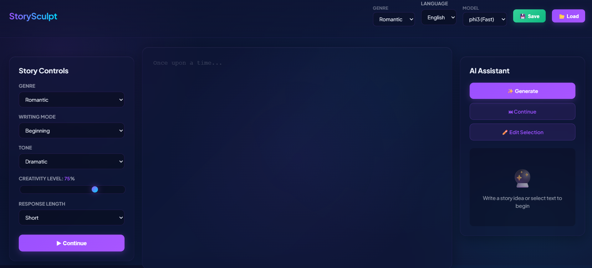
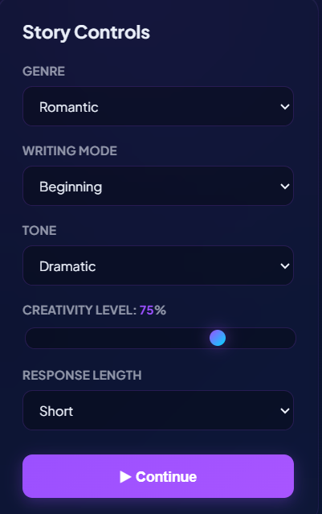
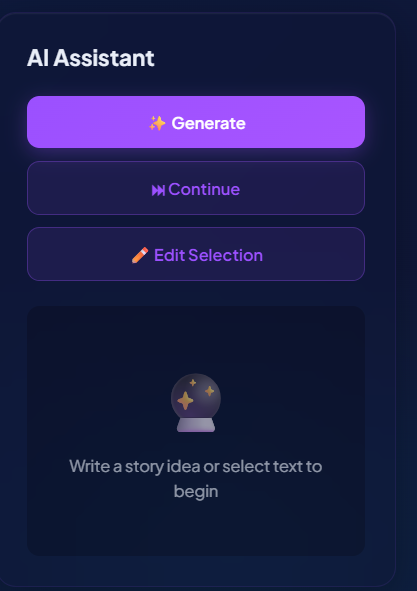

# AI Narrative Co-Writer (StorySculpt)


Developed as part of the Infosys Springboard Virtual Internship (Batch 13)
Team C

---
## Team

Aamir
Swathi
Ashima
Nivethitha
Rajeswari

---

## Live Demo

https://swathisree50.github.io/Ai-Narrative-Co-writer/

---

## Overview

AI Narrative Co-Writer (StorySculpt) is an intelligent storytelling system designed to generate structured, coherent, and context-aware narratives in real time.

Unlike traditional text generation tools that produce isolated outputs, this system focuses on narrative continuity, logical progression, and user-guided storytelling. It enables users to control story parameters such as genre, tone, and creativity level while maintaining consistency throughout the narrative.

---

## Problem Statement

Traditional AI-based text generation systems suffer from the following limitations:

| Issue              | Description                                   |
| ------------------ | --------------------------------------------- |
| Lack of continuity | Generated content lacks logical progression   |
| No context memory  | Previous outputs are not retained effectively |
| User dependency    | Users must manually guide story direction     |
| Fragmented output  | Text appears disconnected and inconsistent    |

---

## Proposed Solution

The system introduces a structured storytelling framework that:

* Maintains narrative context across interactions
* Provides guided story development
* Enables parameter-based customization
* Reduces user cognitive load

---

## Features

* AI-driven story generation
* Context-aware continuation
* Genre-based customization
* Writing mode selection (Beginning / Continue)
* Adjustable creativity levels
* Response length control
* Save and load functionality
* Clean and responsive interface

---

## Screenshots

### Main Interface
<p align="center">
  
</p>

### Story Controls Panel
<p align="center">
  
</p>

### AI Assistant Panel
<p align="center">
  
</p>

---

## System Architecture

```text id="arch_master"
User Interface (Browser)
        ↓
Frontend Layer (HTML, CSS, JavaScript)
        ↓
Input Processing Module
        ↓
Backend Server (Node.js)
        ↓
Prompt Engineering Layer
        ↓
Ollama (Local Language Model)
        ↓
Generated Narrative Output
        ↓
Frontend Display
        ↓
User Interaction
```

---

## Workflow

```text id="flow_master"
Start
  ↓
User selects parameters
  ↓
Frontend sends request
  ↓
Backend constructs prompt
  ↓
AI model generates output
  ↓
Response displayed
  ↓
User continues / edits / saves
  ↓
End
```

---

## Theoretical Foundation

### Narrative Flow vs Text Generation

Narrative generation requires:

* Context preservation
* Logical sequencing
* Character and plot consistency

Traditional systems focus only on token-based prediction, whereas this system introduces structured storytelling.

---

### Cognitive Load Distribution

| Task                 | Traditional Systems | StorySculpt |
| -------------------- | ------------------- | ----------- |
| Context handling     | User                | System      |
| Story flow           | Manual              | Guided      |
| Continuity           | Weak                | Strong      |
| Creativity direction | Uncontrolled        | Controlled  |

---

### Prompt Engineering

The system uses structured prompts to:

* Control narrative tone
* Maintain story consistency
* Improve output relevance

---

## Comparative Analysis

| Feature           | Traditional AI Tools | StorySculpt          |
| ----------------- | -------------------- | -------------------- |
| Output type       | Isolated text        | Continuous narrative |
| Context awareness | Limited              | Strong               |
| User control      | Low                  | High                 |
| Story structure   | Unmanaged            | Guided               |

---

## Technology Stack

* Frontend: HTML, CSS, JavaScript
* Backend: Node.js
* AI Engine: Ollama (Local LLM)
* Deployment: GitHub Pages

---

## Use Cases

* Creative writing assistance
* Educational storytelling tools
* Content ideation
* Narrative prototyping

---

## Advantages

| Advantage              | Description                                         |
| ---------------------- | --------------------------------------------------- |
| Narrative Continuity   | Maintains logical flow across story progression     |
| Context Awareness      | Retains previous inputs for consistent storytelling |
| User Control           | Allows customization of genre, tone, and creativity |
| Reduced Cognitive Load | System manages structure, reducing user effort      |
| Data Privacy           | Works locally without cloud dependency              |
| Interactive Experience | Enables real-time interaction and editing           |
| Structured Output      | Produces logically organized narratives             |
| Flexibility            | Suitable for both beginners and advanced users      |

---

## Project Structure

```text id="struct_master"
Ai-Narrative-Co-writer/
│
├── screenshots/
│   ├── main.png
│   ├── controls.png
│   └── assistant.png
│
├── index.html
├── app.css
├── server.js
├── package.json
└── README.md
```

---

## Local Setup

```bash id="cmd_master"
git clone https://github.com/swathisree50/Ai-Narrative-Co-writer.git
cd Ai-Narrative-Co-writer
npm install
node server.js
ollama serve
```

---

## Future Scope

* Cloud-based deployment
* Multi-user collaboration
* Voice-based story generation
* Advanced memory systems
* Integration with multiple AI models

---

## Conclusion

AI Narrative Co-Writer transforms conventional text generation into structured storytelling by integrating prompt engineering, context retention, and user-guided controls. The system demonstrates a practical and scalable approach to AI-assisted creative writing.

